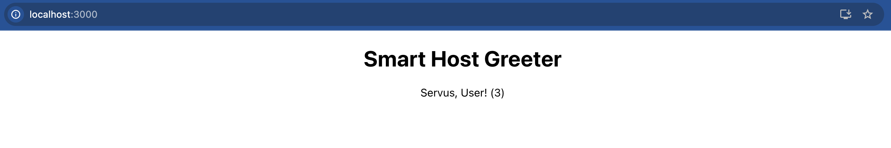

### Necessary tools to emulate it locally:
- docker
- k3d
- kubectl
- kompose

__IMPORTANT__:
- In order to run the docker files properly on ARM based Apple computer I had to remove the `--platform=linux/amd64` switch from dockerfiles and docker-compose file
- Please copy the `REPORT.md` file to the original repository root folder and run all bash scripts to emulate the result.

### Steps:
- Create cluster and local registry
    ```bash
    k3d cluster create devops-challenge-cluster \
    --registry-create artifact-registry:5000              # Create a cluster and local registry
    ```

- Verify the cluster and the registry
    ```bash
    k3d cluster list | grep devops-challenge-cluster      # Verify the existence of the cluster 
    k3d registry list | grep artifact-registry            # Verify the registry is created on k3d
    docker ps | grep artifact-registry                    # Verify the existence of the container
    curl http://localhost:5000/v2/_catalog                # Verify the registry is reachable locally
    ```
  
    - expected output:
      ```
      $ k3d cluster list | grep devops-challenge-cluster
      devops-challenge-cluster   1/1       0/0      true
    
      $  k3d registry list | grep artifact-registry
      artifact-registry   registry   devops-challenge-cluster   running
    
      $  docker ps | grep artifact-registry                  
      ed80066f68eb   registry:2                       "/entrypoint.sh /etc…"   2 hours ago   Up 2 hours   0.0.0.0:5000->5000/tcp            artifact-registry
  
      $ curl http://localhost:5000/v2/_catalog
      {"repositories":[]}
      ```

- Upload backend docker image to the local registry
    ```bash
    docker build --no-cache -t backend:v0.1 backend       # Build the backend Dockerfile
    docker tag backend:v0.1 localhost:5000/backend:v0.1   # Tag the backend docker image
    docker push localhost:5000/backend:v0.1               # Push the docker image to the local registry
    curl http://localhost:5000/v2/_catalog                # Verify the docker image upload was successful
    ```
  
    - expected curl output:
      ```
      $ curl http://localhost:5000/v2/_catalog
      {"repositories":["backend"]}
      ```

- Upload frontend docker image to the local registry
    ```bash
    docker build --no-cache -t frontend:v0.1 frontend     # Build the backend Dockerfile
    docker tag frontend:v0.1 localhost:5000/frontend:v0.1 # Tag the backend docker image
    docker push localhost:5000/frontend:v0.1              # Push the docker image to the local registry
    curl http://localhost:5000/v2/_catalog                # Verify the docker image upload was successful
    ```
  
    - expected curl output:
      ```
      $ curl http://localhost:5000/v2/_catalog
      {"repositories":["backend","frontend"]}
      ```

- Convert docker-compose to kubernetes manifests
    ```bash
    kompose convert                                       # Convert docker-compose file           
    mkdir -p k8s/backend k8s k8s/frontend          
    mv backend-deployment.yaml backend-service.yaml \
      k8s/backend/                                        # Put backend deployment and service yaml files into the k8s_backend directory 
    mv frontend-deployment.yaml frontend-service.yaml \
      k8s/frontend/                                       # Put frontend deployment and service yaml files into the k8s_frontend directory
    ```

- Edit the deployment yaml files to correct the image references
    ```bash
    sed -i '' 's/image: .*/image: artifact-registry:5000\/backend:v0.1/' k8s/backend/backend-deployment.yaml
    sed -i '' 's/- image: .*/- image: artifact-registry:5000\/frontend:v0.1/' k8s/frontend/frontend-deployment.yaml
    ```

- Create horizontal pod autoscaler for the backend
```bash
echo "apiVersion: autoscaling/v2
kind: HorizontalPodAutoscaler
metadata:
  name: backend-autoscaler
spec:
  minReplicas: 2
  maxReplicas: 5
  metrics:
    - resource:
        name: cpu
        target:
          averageUtilization: 80
          type: Utilization
      type: Resource
  scaleTargetRef:
    apiVersion: apps/v1
    kind: Deployment
    name: backend" > k8s/backend/backend-hpa.yaml
```

- Deploy the resources
    ```bash
    kubectl apply -f k8s/backend
    kubectl apply -f k8s/frontend
    ```
    - expected output:
      ```
      $ kubectl apply -f k8s/backend
      deployment.apps/backend created
      horizontalpodautoscaler.autoscaling/backend-autoscaler created
      service/backend created

      $ kubectl apply -f k8s/frontend
      deployment.apps/frontend created
      service/frontend created
      ```

- Verify resources
    ```bash
    kubectl get deployments
    kubectl get services
    kubectl get hpa
    kubectl get pods
    #kubectl logs <POD_NAME>
    ```
    - expected output:
      ```
      $ kubectl get deployments
      NAME       READY   UP-TO-DATE   AVAILABLE   AGE
      backend    2/2     2            2           116m
      frontend   1/1     1            1           116m
      
      $ kubectl get services
      NAME         TYPE        CLUSTER-IP     EXTERNAL-IP   PORT(S)    AGE
      backend      ClusterIP   10.43.165.38   <none>        8080/TCP   116m
      frontend     ClusterIP   10.43.50.95    <none>        3000/TCP   116m
      kubernetes   ClusterIP   10.43.0.1      <none>        443/TCP    119m
        
      $ kubectl get hpa
      NAME                 REFERENCE            TARGETS              MINPODS   MAXPODS   REPLICAS   AGE
      backend-autoscaler   Deployment/backend   cpu: <unknown>/80%   2         5         2          114m
      
      $ kubectl get pods
      NAME                       READY   STATUS    RESTARTS   AGE
      backend-77b7df8848-jjfhk   1/1     Running   0          109m
      backend-77b7df8848-rlcfh   1/1     Running   0          117m
      frontend-667c4bd5-wdsf5    1/1     Running   0          117m
        
      $ kubectl logs backend-77b7df8848-jjfhk
      Server is running on port 8080
      SLF4J: Failed to load class "org.slf4j.impl.StaticLoggerBinder".
      SLF4J: Defaulting to no-operation (NOP) logger implementation
      SLF4J: See http://www.slf4j.org/codes.html#StaticLoggerBinder for further details.
        
      $ kubectl logs backend-77b7df8848-rlcfh
      Server is running on port 8080
      SLF4J: Failed to load class "org.slf4j.impl.StaticLoggerBinder".
      SLF4J: Defaulting to no-operation (NOP) logger implementation
      SLF4J: See http://www.slf4j.org/codes.html#StaticLoggerBinder for further details.
        
      $  kubectl logs frontend-667c4bd5-wdsf5
      /docker-entrypoint.sh: /docker-entrypoint.d/ is not empty, will attempt to perform configuration
      /docker-entrypoint.sh: Looking for shell scripts in /docker-entrypoint.d/
      /docker-entrypoint.sh: Launching /docker-entrypoint.d/10-listen-on-ipv6-by-default.sh
      10-listen-on-ipv6-by-default.sh: info: Getting the checksum of /etc/nginx/conf.d/default.conf
      10-listen-on-ipv6-by-default.sh: info: Enabled listen on IPv6 in /etc/nginx/conf.d/default.conf
      /docker-entrypoint.sh: Sourcing /docker-entrypoint.d/15-local-resolvers.envsh
      /docker-entrypoint.sh: Launching /docker-entrypoint.d/20-envsubst-on-templates.sh
      /docker-entrypoint.sh: Launching /docker-entrypoint.d/30-tune-worker-processes.sh
      /docker-entrypoint.sh: Configuration complete; ready for start up
      2024/08/07 21:51:05 [notice] 1#1: using the "epoll" event method
      2024/08/07 21:51:05 [notice] 1#1: nginx/1.27.0
      2024/08/07 21:51:05 [notice] 1#1: built by gcc 13.2.1 20231014 (Alpine 13.2.1_git20231014)
      2024/08/07 21:51:05 [notice] 1#1: OS: Linux 6.6.16-linuxkit
      2024/08/07 21:51:05 [notice] 1#1: getrlimit(RLIMIT_NOFILE): 1048576:1048576
      2024/08/07 21:51:05 [notice] 1#1: start worker processes
      2024/08/07 21:51:05 [notice] 1#1: start worker process 29
      2024/08/07 21:51:05 [notice] 1#1: start worker process 30
      2024/08/07 21:51:05 [notice] 1#1: start worker process 31
      2024/08/07 21:51:05 [notice] 1#1: start worker process 32
      2024/08/07 21:51:05 [notice] 1#1: start worker process 33
      2024/08/07 21:51:05 [notice] 1#1: start worker process 34
      2024/08/07 21:51:05 [notice] 1#1: start worker process 35
      2024/08/07 21:51:05 [notice] 1#1: start worker process 36
      ```

- Verify the services are able to reach each other
  ```bash
  kubectl exec -it frontend-667c4bd5-wdsf5 -n default -- curl http://backend:8080
  ```
  
  - expected output:
    ```
    $ kubectl exec -it frontend-667c4bd5-8xrz8 -n default -- curl http://backend:8080
    Servus, User! (1)% 
    ```  
    
  ```bash
  kubectl exec -it backend-77b7df8848-rlcfh -n default -- curl http://frontend:3000
  ```
  - expected output:
    ```
    $ kubectl exec -it backend-77b7df8848-rlcfh -n default -- curl http://frontend:3000
    <!doctype html><html lang="en"><head><meta charset="utf-8"/><link rel="icon" href="/favicon.ico"/><meta name="viewport" content="width=device-width,initial-scale=1"/><meta name="theme-color" content="#000000"/><meta name="description" content="Web site created using create-react-app"/><link rel="apple-touch-icon" href="/logo192.png"/><link rel="manifest" href="/manifest.json"/><title>React App</title><script defer="defer" src="/static/js/main.98a963f3.js"></script><link href="/static/css/main.f855e6bc.css" rel="stylesheet"></head><body><noscript>You need to enable JavaScript to run this app.</noscript><div id="root"></div></body></html>% 
    ``` 
    
- Temporary test the services in localhost with port forwarding
  ```bash
  kubectl port-forward service/backend 8080:8080 &
  kubectl port-forward service/frontend 3000:3000 &
  ```

- Verify backend 
  ```bash
  curl http://localhost:8080
  ```
  - expected output:
    ```
    $ curl http://localhost:8080
    Servus, User! (2)%
    ```    

- Verify frontend visually (on browser)



# Questions/Answers:

### CI/CD

How would you set up a basic CI/CD pipeline to build, test, and deploy the microservices to the remote Kubernetes cluster?
What deployment strategy would you recommend for deploying updates to the microservices in the Kubernetes cluster, and how would you implement it in the CI/CD pipeline?

To set up a basic CI/CD pipeline for building, testing, and deploying microservices to a remote Kubernetes cluster, I would follow these steps:

#### Application CI/CD Pipeline
- Build stage
  - pre-commit (run linters to to keep code consistency)
  - build (build environment)
- Test stage:
  - unit test
  - integration test
- Publish stage
  - image upload (build and upload docker image to the artifact registry)
  - scan vulnerabilities

#### Kubernetes Manifest Management
- Repository Structure:  For the kubernetes manifest I would store them in a centralized way. One repository should contain all kubernetes manifests files. in a hierarchy.

  ```
  some_service_a
  ├── DEV_PROJECT
  │ ├── deployment.yaml
  │ ├── service.yaml
  │ ├── kustomization.yaml
  │ ├── service-account.yaml
  │ └── service.properties
  └── PROD_PROJECT
    ├── deployment.yaml
    ├── service.yaml
    ├── kustomization.yaml
    ├── service-account.yaml
    └── service.properties
  ```
- Customization with Kustomize:
  Use Kustomize to tailor manifest files for different environments. This allows you to maintain a base configuration and apply environment-specific overlays without duplicating the entire set of manifest files.

#### Deployment Automation

For deployment automatization I would choose ArgoCD which would be synced with the kubernetes repo. I would store the argocd configurations in a different repo.

---
### Metrics

What tools or platforms do you use for collecting and visualizing metrics in a Kubernetes environment?

- Prometheus for collecting metrics
- Grafana for visualizing metrics

What are some key metrics you would monitor for a Kubernetes cluster and why?

- State of kubernetes pods
  - To understand the health and operational status of application
- Pod logs
  - To understand what happens with the service
- Pod restart
  - To detect issues causing Pods to restart frequently
- Memory/CPU usage POD/Node/Cluster level
  - For resource usage optimization, performance measurements

---
### Logging

Describe your approach to centralized logging in a Kubernetes environment.
What tools do you prefer for log aggregation and analysis, and why?

- I would choose Loki or Elastic Stack, but since I have experience with prometheus and grafana I would choose Loki/Grafana.

---
### Monitoring:

What is your process for setting up monitoring alerts in Kubernetes?
How do you ensure high availability and fault tolerance in your monitoring setup?

- I would set up alert rules based on metrics collected by Prometheus.
- Configuring them to monitor critical system thresholds and performance indicators. 
- When thresholds are breached, alerts are sent to Opsgenie, which acts as a centralized alert management system.
- The alerts would notifies the relevant team members via Teams, Slack, or email. 
- To ensure high availability and fault tolerance in Kubernetes, I would implement redundant pods and use a rolling update strategy to manage deployments. 